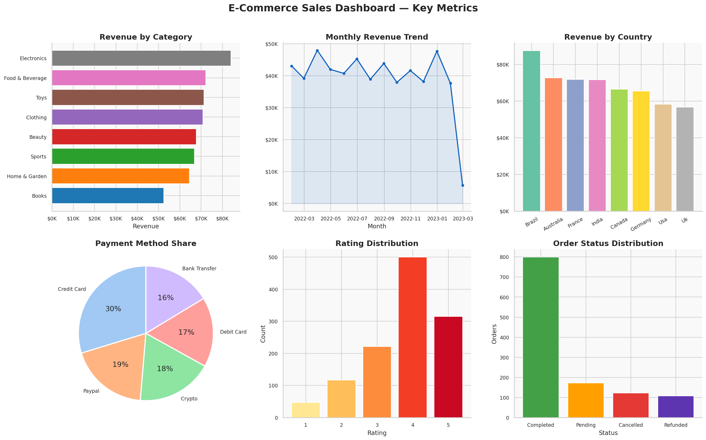

# 🛒 E-Commerce Sales — Data Cleaning & Visualization Project



---

## 📌 Project Overview

This is an end-to-end **Data Analysis project** on an E-Commerce Sales dataset.  
The project covers data cleaning, exploratory data analysis (EDA), and professional visualizations — built using Python.

> ✅ Suitable for: **Internship Submission · College Mini Project · GitHub Portfolio**

---

## 🛠️ Tools & Libraries Used

| Tool | Purpose |
|------|---------|
| Python 3.10 | Core programming language |
| Pandas | Data manipulation & cleaning |
| NumPy | Numerical computations |
| Matplotlib | Base plotting library |
| Seaborn | Statistical visualizations |
| Jupyter Notebook | Interactive development environment |

---

## 📂 Project Structure

```
ecommerce-data-analysis/
│
├── ecommerce_data_project.ipynb   ← Main Jupyter Notebook (fully executed)
├── ecommerce_raw.csv              ← Original raw dataset (with messiness)
├── ecommerce_cleaned.csv          ← Final cleaned dataset
├── dashboard_summary.png          ← 6-panel summary dashboard
├── plot_01_category_revenue.png   ← Revenue by category
├── plot_02_monthly_trend.png      ← Monthly revenue trend
├── plot_03_revenue_distribution.png
├── plot_04_scatter.png            ← Price vs Revenue scatter
├── plot_05_boxplot.png            ← Box plot by category
├── plot_06_heatmap.png            ← Correlation heatmap
├── plot_07_payment.png            ← Payment method analysis
├── plot_08_age_status.png         ← Age group breakdown
├── plot_09_day_category_heatmap.png
├── plot_10_rating_violin.png      ← Rating distribution
└── README.md                      ← This file
```

---

## 🔍 Project Workflow

### 1. 📦 Import Libraries
Pandas, NumPy, Matplotlib, Seaborn — with professional plot settings applied globally.

### 2. 🗂️ Dataset Overview
- 1,200+ e-commerce transactions
- 13 columns: Order ID, Date, Category, Country, Price, Quantity, Revenue, Rating, etc.
- Intentionally messy: nulls, duplicates, outliers, mixed formatting

### 3. 🧹 Data Cleaning (6-Step Pipeline)

| Step | Action | Detail |
|------|--------|--------|
| 1 | Remove Duplicates | 80 exact duplicate rows removed |
| 2 | Fix Formatting | Mixed case → title-case, whitespace stripped |
| 3 | Handle Nulls | Numeric → Median; Categorical → Mode |
| 4 | Fix Invalid Values | Negative quantities corrected |
| 5 | Treat Outliers | IQR Winsorization on price & revenue |
| 6 | Schema Cleanup | snake_case columns, new time features added |

### 4. 🔍 Exploratory Data Analysis
- Value counts for all categorical columns
- Correlation matrix analysis
- Monthly & weekly revenue trends
- Revenue grouped by Category, Country, Age Group
- Order status anomaly detection

### 5. 📊 Visualizations (10 Charts)

| # | Chart Type | Insight |
|---|-----------|---------|
| 1 | Horizontal Bar | Revenue by product category |
| 2 | Line + Fill | Monthly revenue trend with rolling average |
| 3 | Histogram + KDE | Revenue distribution |
| 4 | Scatter Plot | Unit price vs revenue by category |
| 5 | Box Plot | Revenue spread & outliers per category |
| 6 | Heatmap | Feature correlation matrix |
| 7 | Donut + Bar | Payment method distribution |
| 8 | Grouped Bar | Revenue by age group & order status |
| 9 | Heatmap | Revenue by weekday × category |
| 10 | Violin Plot | Customer rating distribution |

---

## 💡 Key Business Insights

- 🏆 **Electronics & Home & Garden** are the top revenue-generating categories
- 👤 **Age group 26–35** spends the most on average
- 💳 **Credit Card** is the most preferred payment method (30%+)
- ❌ **~12% cancellation rate** — significant revenue leakage to address
- ⭐ **65% of orders** have a rating of 4 or 5 — strong customer satisfaction
- 📅 Revenue peaks **mid-week (Wed–Thu)** — best time for promotions

---

## 🚀 How to Run

### Option 1 — Jupyter Notebook (Local)
```bash
# Install dependencies
pip install pandas numpy matplotlib seaborn jupyter

# Launch notebook
jupyter notebook ecommerce_data_project.ipynb
```

### Option 2 — Google Colab (Online, No Install)
1. Go to [colab.research.google.com](https://colab.research.google.com)
2. File → Upload Notebook → select `ecommerce_data_project.ipynb`
3. Runtime → Run All

---

## 📈 Future Improvements

- 🔮 Revenue forecasting using ARIMA / Prophet
- 🤖 Customer segmentation using K-Means clustering
- 🌐 Geospatial revenue map with GeoPandas
- 📊 Interactive dashboard using Streamlit or Dash
- 🎯 Churn prediction model using Logistic Regression

---

## 👤 Author

**Your Name**  
📧 your.email@example.com  
🔗 [LinkedIn](https://linkedin.com/in/yourprofile) · [GitHub](https://github.com/yourusername)

---

*This project was developed as a data analysis portfolio project for internship and academic submission.*
